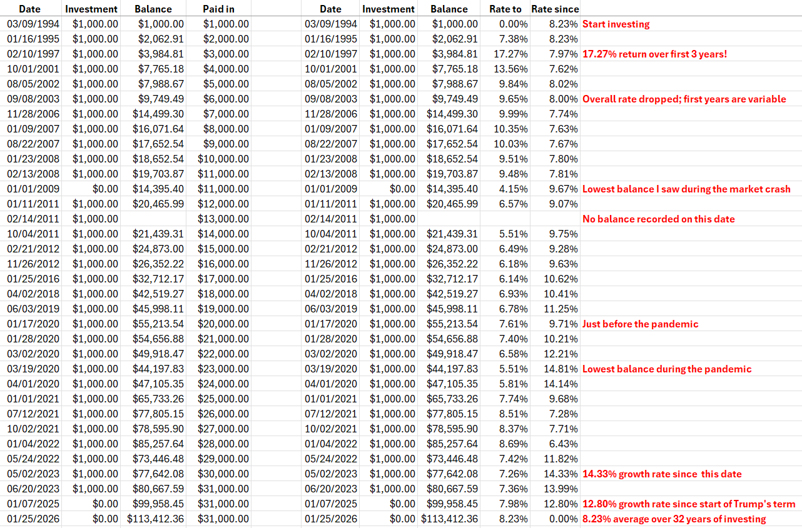

* TOC
{:toc}

# Investment Return Calculator
It's good to save money for the future, but it can be hard to tell how well your investment choices are working out when you make many contributions over a long period of time.
You can often find the rate of return for a mutual fund or savings account over the last month, year, 3 years, 5 years, but those are generic numbers that are not aware of how much you invested and when.

The Investment Return Calculator takes in the dates and amounts when you invested and the balances that you ended up with, and calculates an average rate of return of the investments.
The idea is to find one annual rate of return that would turn all of your investments over time into the final balance; in other words, if your investments earned at one constant rate of return over the whole time that you were investing, what would that rate be?
This way of calculating is called the internal rate of return (IRR).
Excel has an IRR function, but it's a bit hard to use because it requires the ending balance to be 0, which it's not going to be until you sell it all.
In fact, the Investment Return Calculator calculates a history of your rate of return from your first investment up to each date that you record a balance, and from each date with a balance up to the last date.
You can enter the balance on whatever day you happen to look it up, not only on dates when you invest money.
Some investment accounts you may put money it and take it out, and the Investment Return Calculator can still tell your average rate of return.

## How to Use

The Investment Return Calculator is a single, plain HTML file.
You can use it in two ways:

### Run it in your browser
[Open the calculator in your browser](https://clzirbel.github.io/investment_return_calculator/investment_return_calculator.html) to start calculating right away.
Your browser fetches the calculator as a web page and runs the calculation in memory on your computer.
Your financial data never leaves your computer—it exists only in your browser's memory while you're using it.
No data is transmitted or stored anywhere.
You can disconnect from the internet and verify that it still works.

### Download and run locally
Right click the link above and Save As ... to save the file as investment_return_calculator.html on your computer.
Put it where it is easy to find, like in the same folder where you track your investments.
You can then open it in a web browser by double clicking on the file; you do not need to be connected to the internet.
Since the calculator runs entirely in your browser, your financial information is never transmitted anywhere—it stays completely private on your device.

Both methods offer the same functionality with complete privacy and security. Your data is processed entirely on your computer with no external connections.

## Input Data

For multiple investments in the same thing over time, like contributions to an IRA over many years, copy and paste data into the first box below in this format:

- Column 1, date in MM/DD/YYYY or YYYY/MM/DD or DD Month YYYY format.  Every line needs a date.
- Column 2, dollar amount invested (positive) or sold (negative).  All money in and out must be included, with a date!
- Column 3, balance as of that date.  Not every line needs a balance.

If you have the balance on some date that you did not invest, you can put it in with investment amount 0.
Entries on each row should all be separated by tabs (as when copied from a spreadsheet) or by semicolons or by spaces if the date has no space.
Don't mix separators within a single line.
Dollar signs and commas will be stripped out from the input.

## Output Analysis

Results of the analysis are shown in the second box on the page.
Suggestion to view the results: click in the box, select all (Ctrl-A), copy (Ctrl-C), and paste (Ctrl-V) into a spreadsheet, in new columns, not over top of your records.
The first three columns of the results are the same as the input.
The fourth column ("Rate to") shows the average rate of return from the first date to the date on each row.
The fifth column ("Rate since") shows the average rate of return from the date on the row to the last date.
The rate of return will only be calculated for dates with a balance.

## 32-year Example

I started investing in an IRA with Pax World Fund in 1994.
From 1994 to 2026, I made 31 investments of various amounts, and kept track of the dates that I invested, the amount I invested on each date, and the balance on that date, when I could, and on other dates that I happened to check to balance.
To make this example, I set all of the investment amounts to $1,000 and adjusted the balances to reflect the actual earning and losses of Pax World Fund.
The investment performance is exactly the same as what I experienced, but the dollar amounts are modified so I could use it as a public example.

The image below shows the data and the analysis.
- Column A shows the dates of investments or when I checked the balance
- Column B shows the amount invested on that date; withdrawals would be negative numbers
- Column C shows the balance on that date; not all dates have a balance and that's OK
- Column D uses an Excel formula to tally up the total invested
I selected the data from column A, B, C rows 2 to 35 and pasted into the Investment Return Calculator.
- Column F is the date as output by the calculator and formatted by Excel
- Column G is the investment amount
- Column H is the balance, same as Column C
- Column I tells the average rate from the first date in 1994 until the date in the row
- Column J tells the average rate from the date in the row until the last date, in 2026
- Column K has some comments and observations

A few more comments about the data shown above.
In the first few years of the investment, the average rate of return varied wildly between 7% and 17%.
That is normal, because prices on the market fluctuate a lot on the short term.
But by about 2021, which is 27 years later, the overall rate of return settles down to around 8%.

Pax World Fund is a balanced fund, about 60% stocks and 40% bonds.
It has a somewhat lower average rate of return than pure stock funds.

You can download the data and the analysis of the Investment Return Calculator in the [Excel spreadsheet I uploaded](assets/example.xlsx).
You can use that spreadsheet as a template to record your own investments.

